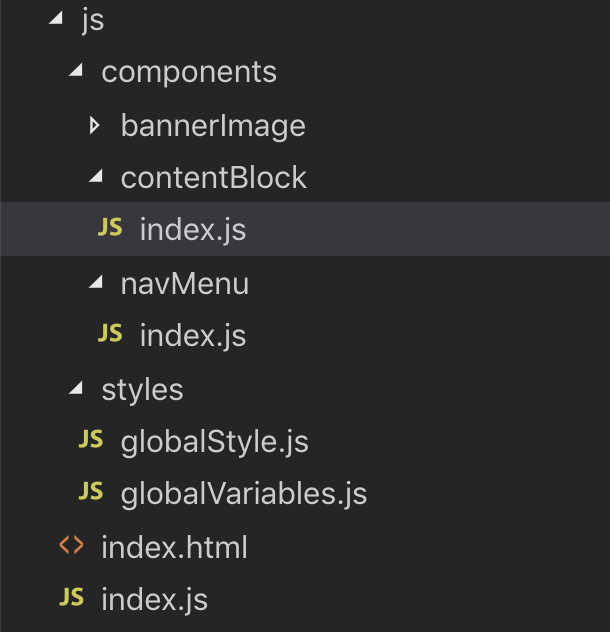

CSS in JS is a real 'hotness' and in many ways is very much a 'thing' nowdays when it comes to building applications on the web. I decided to test my 'traditionalist' sentiments with CSS and take on an experiment. I went in with an open mind to truely answer the question... is it really better then CSS?

I was pretty convinced I knew what was going to be the outcome. I have always had an eye on CSS in JS however never really got around to fully forming an opinion on it. Being a ‘traditionalist’ I am very beholdent to CSS standing on its own and Javascript having its own space and styling components wasn’t one of them.

As a bit of background, early on in my career I was in your classic ‘web agency’ operation. Building websites for businesses. Javascript at that time was effectively JQuery, and anything stylistic with Javascript was a right pain. So, lets just say, those years were formative in me taking an anti-stylistic approach to Javascript.

I since moved to the product space building large scale applications with a tonne of logic and scaling complexity and really embedded myself in the 'React' world, but still leant on CSS as a styling mechanism.

In recent events, I was exposed to _styled-components_ on a production product and was intrigued by its function. I saw first hand its potential. The idea of housing stylistic variations of the same component in the same file, seemed **really** nice to me.

```
import * as React from "react";
import styled from "styled-components";

const StyledButton = styled.button`
    padding: 3px 10px;
`;

export const Button = () => (
    <StyledButton>
        Button Text
    </StyledButton>
);
```

This made a lot of sense as it kept everything in a nice package. From my experience in large scale application, things in 'nice packages' and components that 'made sense' is an exciting space to exist. With this, everything I needed to know about the button logically and stylistically was housed in the one file.

My conclusion at this time was “It can work for things like components, but if you were to introduce layout styles like `grid`, it will become overwhelming. So my position was, “anything structural should be CSS, anything logical can be a `styled-component`.

To put this to the test, I decided on a rather simple experiment. Compose 3 identical UI’s which each have a toggle navigation menu, a banner image and 3 columns. A fairly ‘boilerplate’ agency layout.


Build one the _'old way'_ using purely CSS (Sass), One the \_'new way'\_using purely JS (`styled-components`) and a 3rd to put my position suggestion “logical components in styled components, and layout in CSS” to the test.

All of this can be found in this [GitHub repo](https://github.com/lindsayjopson/css-vs-js).

### Pure CSS Approach:

Code: `https://github.com/lindsayjopson/css-vs-js/tree/master/css`


The general structure of the folders suggest, in the `styles` folder house global and shared styles and variables. Things like $black, $white, \$base-spacing etc.
If we were to look into the contentBlock component you would see:

```
// contentBlock/index.js

import * as React from "react";

export const ContentBlock = () => (
    <div className="content_block">
        <h3>Content Heading</h3>
        <p>
            Content
        </p>
    </div>
);

// _contentBlock.scss

.content_block {
    display: flex;
    flex-direction: column;
    flex-basis: 100%;
    flex: 1;
    padding: 20px;
}
```

The separation of concerns here is pretty clear. The `index.js` file takes care of the React rendering, and the `.scss` takes care of the layout. In practice I have enjoyed this separation. Its the classic “put a classname here, place the css for that classname there”. From an on boarding and understanding of ‘how it fits’ is pretty clean and clear.

### Pure JS Approach

Code: `https://github.com/lindsayjopson/css-vs-js/tree/master/js`



The folder structure is exactly that of above, for this exercise I really wanted to make them as close as possible without letting ‘folder structure’ get in the way of the final thought. For this, I effectively merged the `.scss` file with the `.js` file, and replaced the `style/*.scss` with `globalStyles.js` and `globalVariables.js`.

To revisit `contentBlock/index.js`

```
import * as React from "react";
import styled from "styled-components";

const ContentWrap = styled.div`
    display: flex;
    flex-direction: column;
    flex-basis: 100%;
    flex: 1;
    padding: 20px;
`;

export const ContentBlock = () => (
    <ContentWrap>
        <h3>Content Heading</h3>
        <p>
            Content Text
        </p>
    </ContentWrap>
);
```

To me, this makes total sense, you are combining everything regarding a `ContentBlock` in one place. Its small, its tidy and its logical.
However, `ContentBlock` aside, lets look into our `globalStyles`.

For this we need to understand a couple concepts.

Global Variables.
CSS Only. I created a `_variables.scss` file which housed all the Sass variables.

```
//colors
$white: #ffffff;
$black: #000000;

//font
$base-font-family: "Source Sans Pro", sans-serif;
```

This file is then @imported above other `*.scss` files which makes `$white` available across other `*.scss` files.

JS Only. We have a `globalVariables.js` file, which contains the following

```
//colors
export const white = "#ffffff";
export const black = "#000000";

//font
export const baseFontFamily = "'Source Sans Pro', sans-serif";
```

These can then be imported into files much like any other variable.
`import { white, black, baseFontFamily } from "./globalVariables";`

Global Styles.
CSS Only. I created a `_base.scss` file. This houses all the classic ‘base’ styling for an app.

```
body {
	font-family: $base-font-family;
    font-size: $base-font-size;
}
```

This is then important in the `style.scss` file which automatically makes those set.

JS Only. `styled-components` exposes a `createGlobalStyle` function which you pass in the same content as above without the Sass Variables`.

```
import { createGlobalStyle } from "styled-components";

import {
	baseFontFamily,
	baseFontSize,
} from "./globalVariables";

export const GlobalStyle = createGlobalStyle`
	body {
		font-family: ${baseFontFamily};
		font-size: ${baseFontSize};
	}
`;
```

Added complexity.

So the stuff we have been playing with up until now have been rather simplistic, not a log of ’style’ is involved and mainly sitting around layout function.
For this exact reason I added a toggle-able navigation. As far as ’style’ goes I would say this is still on the ‘basic’ style, but it was a good indicator of adding complexity to the system.

CSS Only:

```
import React, { useState } from "react";

export const NavMenu = () => {
let [isHidden, setState] = useState(false);

    return (
        <div className={`nav_wrap ${isHidden ? "hidden" : "visible"}`}>
        <div className="nav_toggle"
            onClick={() => setState(isHidden === true ? (isHidden = null) : (isHidden = true))}
        >
            <div className="hamburger">
                <div className="line"></div>
                <div className="line"></div>
                <div className="line"></div>
            </div>
        </div>
        <ul className="nav_menu”>
            <li className="nav_menu--item”>
                <a href="#">Menu Item</a>
            </li>
            <li className="nav_menu--item">
                <a href="#">Menu Item</a>
            </li>
            <li className="nav_menu--item">
                <a href="#">Menu Item</a>
            </li>
        </ul>
    </div>);
};
```

The functionality to note above is as follows. When `nav_toggle` is clicked, the isHidden state is switched to true or `null`.
By doing this, an additional className will be toggled on the `nav_wrap` of `hidden` or `visible`.
Then in the CSS we have the following to support this stylistic change.

```
.nav_wrap {
	&.hidden {
		left: -350px;
	}
}

.hamburger {
background-color: \$grey-light;

    .hidden & {
        background-color: $white;
    }

    .line {
        position: relative;
        border-top: 2px solid #000000;
        top: 5px;

        &:nth-child(2) {
            top: 11px;

        }

        &:nth-child(3) {
            top: 17px;

        }
    }

    &:hover {
        cursor: pointer;
    }

}

.visible {
	.hamburger {
		&:hover {
			.line {
				top: 14px;
				transform: rotate(45deg);
				transition: 0.3s;
                &:nth-child(2) {
                    display: none;
                }

                &:nth-child(3) {
                    top: 12px;
                    transform: rotate(-45deg);
                }
            }
        }
    }

}
```

While I have removed some of the general styling of this component from the above example, I would like to draw attention to the complexity added to the CSS for this interaction.

There are hover effect which impact nested elements `.hamburger .line`, we have `left: -360px` interactions when the navigation is set to `.hidden` or `.visible`. We have `:hover` states of the individual `.nav-item`. While in the CSS only version, this doesn’t feel too far outside the norm. Wheras if we are to then bring this in to JS Only we are faced with the following.

JS Only

```
const HamburgerLine = styled.div`
	position: relative;
	border-top: 2px solid \${black};
	top: 5px;
    &:nth-child(2) {
        top: 11px;
    }

    &:nth-child(3) {
        top: 17px;
    }
`;

const Hamburger = styled.div`
	position: relative;
	padding: 8px;
	height: 28px;
	background-color: \${greyLight};
	transition: 0.3s;

    .hidden & {
        background-color: ${white};
    }

    &:hover {
        cursor: pointer;
    }

    .visible & {
        &:hover {
            ${HamburgerLine} {
                top: 14px;
                transform: rotate(45deg);
                transition: 0.3s;

                &:nth-child(2) {
                    display: none;
                }

                &:nth-child(3) {
                    top: 12px;
                    transform: rotate(-45deg);
                }
            }
        }
    }

`;

const NavToggle = styled.div`
	position: absolute;
	width: 45px;
	height: 45px;
	right: -45px;`;

const NavMenuWrap = styled.ul`
	list-style-type: none;
	padding: 0;
	margin: 45px 0;
	overflow: hidden;
	background: ${greyLight};
`;

const NavMenuItem = styled.a`
	display: block;
	width: 100%;
	font-size: 18px;
	padding: 8px 20px;
	&:hover {
		background-color: ${grey};
	}
`;

const NavWrap = styled.div`
	position: absolute;
	width: 350px;
	left: 0;
	top: 0;
	bottom: 0;
	background: \${greyLight};
	transition: 0.3s;

    &.hidden {
        left: -350px;
    }

`;

export const NavMenu = () => {
let [isHidden, setState] = useState(false);

    return (
        <NavWrap className={`${isHidden ? "hidden" : "visible"}`}>
            <NavToggle
                onClick={() =>
                    setState(isHidden === true ? (isHidden = null) : (isHidden = true))
                }
            >
                <Hamburger>
                    <HamburgerLine />
                    <HamburgerLine />
                    <HamburgerLine />
                </Hamburger>
            </NavToggle>
            <NavMenuWrap>
                <li>
                    <NavMenuItem href="#">Menu Item</NavMenuItem>
                </li>
                <li>
                    <NavMenuItem href="#">Menu Item</NavMenuItem>
                </li>
                <li>
                    <NavMenuItem href="#">Menu Item</NavMenuItem>
                </li>
            </NavMenuWrap>
        </NavWrap>
    );
};
```

Now we can start to see some scalability concerns with this method. Without appropriate abstraction, components that exhibit high interactivity from a stylistic perspective, matched with a component with a high stylistic complexity; this could easily become extremely cumbersome.

So the question becomes, where is the line? At what point do we decide what should go where, and does the idea of logic remain in component and layout remain in css still ring true to which was originally hypothesised?

### Merged Approach

Code: `https://github.com/lindsayjopson/css-vs-js/tree/master/merged`

For this I went with the approach of “All fixed static styles (those that will not change on events) are housed in CSS, and those that react to events are handled in JS”.

In this case, the NavMenu looked as follows.

```
//\_navmenu.scss

.nav_toggle {
	position: absolute;
	width: 45px;
	height: 45px;
	right: -45px;
}

.nav_menu {
	list-style-type: none;
	padding: 0;
	margin: 45px 0;
	overflow: hidden;
	background: \$grey-light;
}

.nav_menu--item {
	display: block;
	width: 100%;
	font-size: 18px;
	padding: 8px 20px;
	&:hover {
		background-color: \$grey;
	}
}
```

With the styles in JS like this.

```
const HamburgerLine = styled.div`
	position: relative;
	border-top: 2px solid ${black};
	top: 5px;
	&:nth-child(2) {
		top: 11px;
	}
	&:nth-child(3) {
		top: 17px;
	}
`;

const Hamburger = styled.div`
	position: relative;
	padding: 8px;
	height: 28px;
	background-color: ${greyLight};
    transition: 0.3s;
    .hidden & {
        background-color: ${white};
}

    .visible & {
        &:hover {
            ${HamburgerLine} {
                top: 14px;
                transform: rotate(45deg);
                transition: 0.3s;
                &:nth-child(2) {
                    display: none;
                }
                &:nth-child(3) {
                    top: 12px;
                    transform: rotate(-45deg);
                }
            }
        }
    }

    &:hover {
        cursor: pointer;
    }
`;

const NavWrap = styled.div`
	position: absolute;
	width: 350px;
	left: 0;
	top: 0;
	bottom: 0;
	background: ${greyLight};
	transition: 0.3s;
	&.hidden {
		left: -350px;
	}`;
```

Here the driver was to allow context to styles. To understand ‘how the styles change’ based on different events, and use that as a measure on how we seperate concerns.

Going through this exercise this felt like a really nice balance and when explaining why this makes sense to other engineers felt quite sensible. Making changes to the state takes place through Javascript, so if some stylistic changes also take place depending on the state of a component, why not also do that in Javascript.

There was one hurdle that this has created. When adopting one style over another the global variables were super easy to maintain. In CSS I had one `_variables.scss` file which stored all the colours and widths etc I needed, in JS I had a globalVariables.js file which stored all my colours and width. However, with a merged version I needed to maintain two versions of the `globalVariables`.

This in itself is a pretty big issue.

If using Webpack I have come across [this exporting module](https://til.hashrocket.com/posts/sxbrscjuqu-share-scss-variables-with-javascript) which would take your \_variables.scss and export as usable variables in your js. (). To me this is a necessary factor for me to convert to this method of developing.

## Conclusion.

This exercise has done its job for me on my personal journey to explore a hypothesis I had. While the result has completely changed from the original result I thought I would get (CSS is still king) and that’s perfect!

The conclusion has proven that the usage of CSS, CSS-In-JS all depends on what you are doing. I would say if you are going for a static site or application, go with CSS.
If you are going for an application with a bit of dynamic rendering, go CSS-in-JS its great!
If you want to try a bit of both, go with a merged approach. Just be sure on where you draw the line of ‘what’s css and what’s js’.
My approach was to keep all the styles that change based on JS in the `.js` file, all static styles in an accompanied `.scss` file.

The main issue we get with anything when it comes to styling anything is the pace in which it turns to chaos when it scales.
All of these approaches can turn into a mess if they are not kept to their intended separations of concerns. Be clear on your ’best practice’ for the application. Write it down, make it clear.

Below is a small list of Pro’s and Con’s formulated throughout this work. I hope you enjoyed the article and will explore the potential to. Bring JS, CSS or both into your next project.

### CSS only:

**Pros:**

- As you need to ‘name’ everything, this forces you to consider the layout and its function.
- Classic styling method, a lot of people understand this concept and way of styling.
- Great for static sites, classic brochure style websites and websites with minimal ‘event’ styling.
- Great to keep all styling seperate.

**Cons:**

- Naming things are hard.
- CSS can get really messy real quick.
- Requires Stylistic ‘Best Practices’.

### JS only:

**Pros:**

- JS allow you to think dynamically and focus on the component as a whole.
- Keeps all component concerns ’_style and implementation_’ in a single file.
- Great to keep application structures tight and clean.
- Great for applications with a lot of state and dynamic interactivity.
  Cons:
- Everything that needs to be styled becomes a component.
- Your component JS files can get big, quick.
- Drops your classnames from DOM elements so debugging the UI -> codebase is an issue.

### Merged:

**Pros:**

- Great to keep global ‘default’ styling such as `<body>` in the classic way.
- Great opportunity to migrate to a JS approach for your application.
- Enables you to think about styling from a static and event driven perspective.
- Slims down your JS files to only the things you should be concerned about.

**Cons:**

- Global variables need to be kept in 2 places (workaround possible)
- Everyone needs to understand the ’separation of concerns’. (What goes where)
- Could turn into chaos without careful management.

This codebase can be found in this [GitHub repo](https://github.com/lindsayjopson/css-vs-js).

Happy coding!
@lindsayjop
